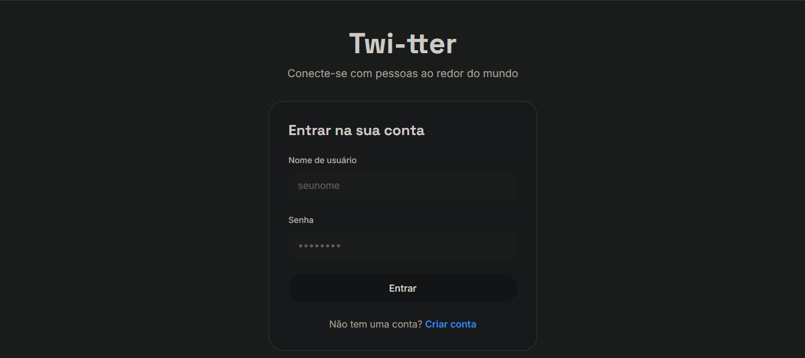
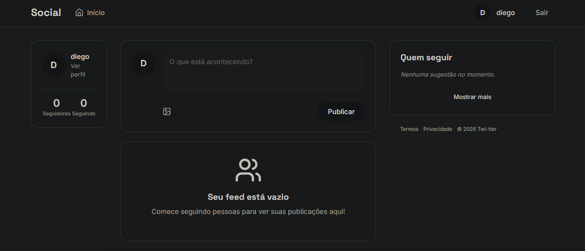

# Twi-tter

### O projeto Twi-tter é inspirado na rede social Twitter(X), desenvolvido com Python e Django, o app tem um sistema completo de interações sociais e suporte a mídias como fotos.

## Tecnologias

* **Django 6.0**: Framework web de alto nível para um desenvolvimento rápido e limpo.
* **Gunicorn**: Servidor HTTP WSGI para rodar a aplicação em ambiente de produção.
* **WhiteNoise**: Permite que a aplicação sirva seus próprios arquivos estáticos de forma eficiente.
* **Pillow**: Biblioteca para processamento e manipulação de imagens (como fotos dos pratos).
* **Asgiref**: Interface padrão para servidores e aplicativos Python assíncronos.
* **Sqlparse**: Utilitário para formatação e análise de consultas SQL.
* **Packaging**: Ferramenta para gerenciar versões e dependências do projeto.

## O que o projeto propõe

* Arquitetura back-end escalável
* Cadastro e Login de forma segura
* Alteração de senha
* Edição de perfil
* Curtir, comentar e seguir
* Sistema de Seguindo e Seguidores